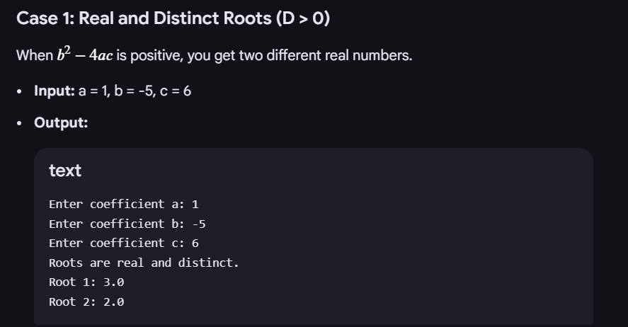
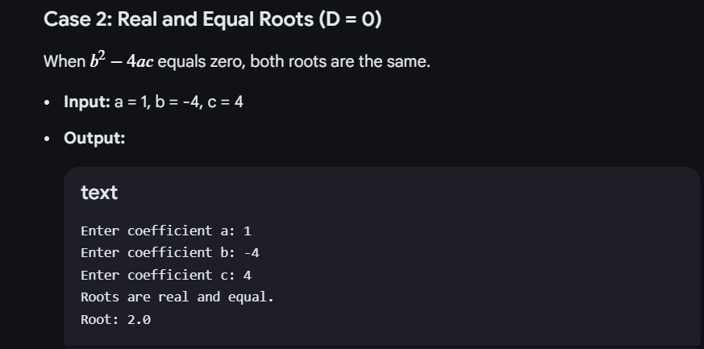
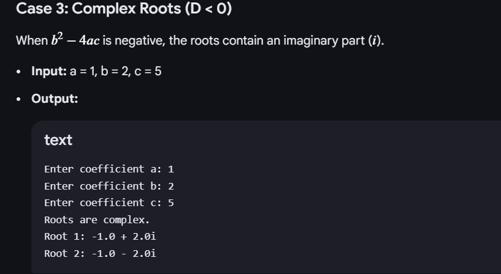

# EXPERIMENT 1
## TITLE : 1a.) Display Primitive Datatypes
```
public class DefaultValues {
    byte b;
    short s;
    int i;
    long l;
    float f;
    double d;
    char c;
    boolean bool;
    public static void main(String[] args) {
        DefaultValues obj = new DefaultValues();
        
        System.out.println("Deafuault byte value :" + obj.b);
        System.out.println("Deafuault short value :" + obj.s);
        System.out.println("Deafuault int value :" + obj.i);
        System.out.println("Deafuault float value :" + obj.f);
        System.out.println("Deafuault double value :" + obj.d);
        System.out.println("Deafuault char  value :" + obj.c);
        System.out.println("Deafuault boolean value :" + obj.bool);
        System.out.println("Deafuault byte value :" + obj.l);
        
        


        
    }
}
```
# OUTPUT


# EXPERIMENT 1
## TITLE : 1b.) Display QuadraticEquation
```
import java.util.Scanner;
public class QuadraticRoots {
    public static void main(String[] args) {
        Scanner sc = new Scanner(System.in);
        double a,b,c;
        double D;
        System.out.println("enter the coefficient of a:" );
         a = sc.nextDouble();
        System.out.println("enter the coefficient of b:" );
         b = sc.nextDouble();
        System.out.println("enter the coefficient of c:" );
           c = sc.nextDouble();
         if(a==0){
             System.out.println("The coefficient is equal to zero not a quadratic root" );
               return;
         }
          
          D = (b*b)-4*a*c;

         if(D>0)
            {
             System.out.println("Roots are real and distinict");
             double x1 =(-b+ Math.sqrt(D)/(2*a));
             double x2 =(-b+ Math.sqrt(D)/(2*a));

         }
         else if(D==0)
             {
                         System.out.println("Roots are real and equal");
            double x =-b/(2*a);
             }
          else
          {
                         System.out.println("Roots are complex");
                         double realpart  = -b/(2*a);
                         double imaginarypart = Math.sqrt(D)/(2*a);
          }
    
                 sc.close();
    }
    
} 

```
# OUTPUT




